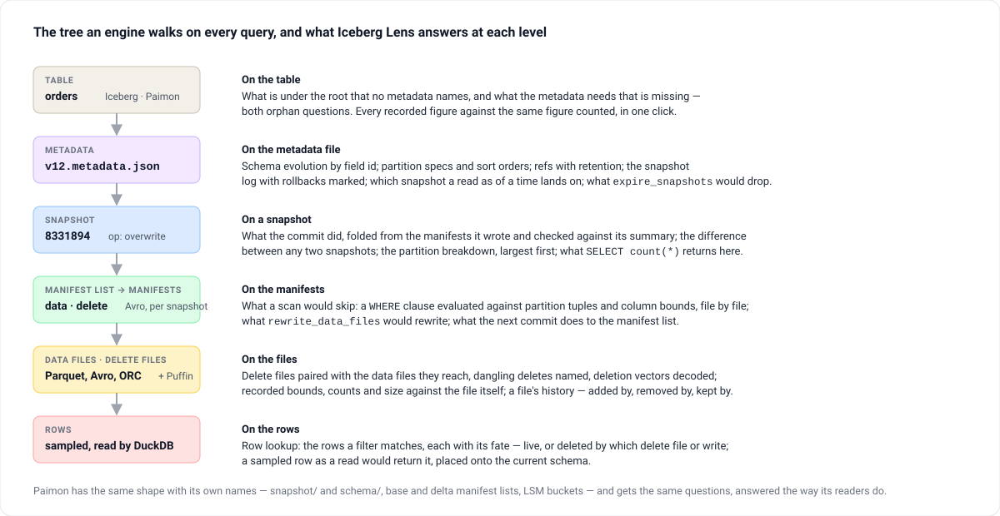

# Iceberg Lens

**A read-only desktop view of what an Apache Iceberg or Apache Paimon table is made of —
the metadata tree, snapshot by snapshot, down to the rows — with every recorded figure
checked against the same figure counted.**

[](https://github.com/mmdemirbas/ice-lens/actions/workflows/ci.yml)
[](https://github.com/mmdemirbas/ice-lens/releases)
[](LICENSE)
[](https://kotlinlang.org/)
[](https://www.jetbrains.com/lp/compose-multiplatform/)

[Website](https://mmdemirbas.github.io/ice-lens/) ·
[Releases](https://github.com/mmdemirbas/ice-lens/releases) ·
[Source](https://github.com/mmdemirbas/ice-lens) ·
[Changelog](CHANGELOG.md) ·
[Project page](https://mdemirbas.com/en/projects/iceberg-lens/) ·
[Why I built it](https://mdemirbas.com/en/posts/2026-02-17-iceberg-lens/)


Point it at a table directory and it renders the structure engines walk on every query —
metadata files, snapshots, manifest lists, manifests, data and delete files, and the rows
inside them — as a graph you can click through, next to an inspector showing every field
the format records. Nothing is written back: the tool answers questions about a table, it
never changes one.

- **Read-only** — never modifies tables or metadata; the object-store filesystem refuses writes by type
- **Local-first** — folders on your machine, or `s3://`, `gs://` and `r2://` with a session-only key
- **Offline** — no catalog, no service; a table is opened by its location
- **Two formats** — Apache Iceberg (v1, v2 and v3) and Apache Paimon, detected per directory
- **Three faces** — a desktop app for macOS, Windows and Linux; an IntelliJ IDEA tool window;
  and `icelens`, a command line over the same engine for scripts, cron jobs and CI

## What it answers, level by level



### What the numbers mean

Table-format figures are easy to state and easy to get wrong, because both formats share
structure on purpose: one manifest is referenced by every snapshot that carries its files
forward. Iceberg Lens reports two sets side by side, each labelled:

| Group | Answers |
|---|---|
| **Current snapshot** | What the table holds now — the manifest closure of `current-snapshot-id`, live entries only. Its record count is what a query returns. |
| **All retained history** | What is still on disk — every manifest and data file reachable from any retained snapshot, deduplicated. This is what expiry and orphan cleanup reason about. |

Caps are always named. When the graph draws a subset of a manifest's entries, the card says
so and the inspector lists all of them.

## The graph


Every node is a card; a click opens it in the inspector, and the structure panel keeps the
same tree as text. Four layouts, a snapshot filter to isolate one commit's subgraph, find by
path or partition or operation, arrow keys across the drawing, and export as SVG, PNG or JSON.

## Everything it does

**Reading the structure**

- Interactive graph of the metadata tree — metadata files, snapshots, manifest lists, manifests, data files, delete files, sample rows — with branches drawn in their own columns and long sibling runs folded into pages that say what they hide
- Inspector panel with every field the format records, each recorded figure beside the same figure counted from the bytes, JSON highlighting, and copy-to-clipboard buttons
- Schema evolution view -- diffs between schema versions (added/dropped/renamed columns, type changes); table properties tracked across metadata versions

**What a scan, a commit or a read does**

- **What a scan would skip**: a filter (`WHERE`-clause or form, with `AND` / `OR` / `NOT` / `IN` / `BETWEEN` / `LIKE`) evaluated against manifest partition summaries and file column bounds, with the term that proved each skip
- **What a commit did** — folded from the manifests it wrote, checked against its own summary — and **what is different between any two snapshots**, on either format, with one side pinned and the other stepped through history
- A file's history on either format — the commit that added it, the one that removed it, and the retained snapshots that still list it live and so keep it on disk
- Both directions of the orphan question, behind a click on the table panel: what is under the table that no metadata names, and what the retained snapshots need that is not there — each missing file with the snapshots that read it
- Which snapshot a read as of a time lands on, the way each engine resolves it — including the abandoned commit a rolled-back table's log still points a time at
- The Iceberg metadata a Paimon table writes beside its own under `metadata.iceberg.storage` — whether the export is current, and which of the table's live files an Iceberg reader sees, with the rule that explains each one it does not

**Deletes, rows and their fate**

- Delete files paired with the data files they reach, dangling deletes named, deletion vectors decoded to the rows they mark, and the live row count behind a click
- **Row lookup** on either format: the rows a filter matches, read from the files it leaves, each with its fate — live, or deleted by which vector, positional delete or equality delete on Iceberg; live, vector-marked, a retraction, or superseded by which later write on Paimon — and, one click further, the same rows traced through the retained snapshots on `main`, with the commit that put them in, changed them or removed them
- **A sampled row's own fate**, on its panel: on Iceberg the delete files paired with its file asked for it; on Paimon the merge engine over its key's records — `deduplicate`, `first-row`, `partial-update` with sequence groups, `aggregation` — or, under data evolution, the row as a read stitches it from the file and its patches
- What `SELECT count(*)` returns as of a snapshot, on either format — on Iceberg the delete files applied per data file, on Paimon the merge over each bucket's files under the table's merge engine, less retractions and vector-marked keys, and the level-0 files a batch read never opens — beside the row total the snapshot records

**Checks against the bytes**

- One click checks every figure the metadata records against the same figure counted — the metadata file's own ids and lengths, manifest counts and lengths, commit summaries, snapshot totals, Paimon record counts, each file's partition against its own bounds — over the whole table
- Per-snapshot partition breakdown, largest first; per-partition and table statistics files opened and shown against their records
- A data file's recorded bounds, counts, size and split offsets checked against the file itself — its rows, its size on disk and its Parquet row groups — behind a click on the file, and over every live file under the integrity check
- Why a column has the statistics it has, on either format: each column's `write.metadata.metrics.*` or `metadata.stats-mode` mode with the rule that set it — the default, a per-column override, the sort-column promotion, a column limit, a per-level mode — and whether the file records that shape

**Maintenance, planned the way the engine plans it**

- What `expire_snapshots` would remove and what keeps the rest — a ref on Iceberg, a consumer or the retention bounds on Paimon — and which files that frees: by which cleanup on Iceberg, and past which tag on Paimon; rollbacks read off the snapshot log
- A Paimon bucket as its LSM tree — sorted runs against the compaction trigger — and what the next flush would compact, the way `UniversalCompaction` picks it
- What `rewrite_data_files` would rewrite at a snapshot, and what the next commit would do to its manifest list — both planned the way Iceberg's own planners decide it, and checked against rewrites and merges the fixtures ran
- A maintenance summary on the table panel: what each procedure would do if run now, one line each, with the panel that explains it

**The tool itself**

- Find on the graph (`Ctrl/Cmd + F`) by path, partition, operation, branch or error text; arrow-key navigation over the drawing
- Export the graph as SVG, PNG or JSON, and the file inventory as CSV
- Four layouts (layered left-to-right, top-to-bottom, tree, force-directed); snapshot filtering to isolate a subgraph
- Workspace tree for multiple warehouses and tables, local or in object storage, with a format badge per table; auto-reload on change
- Movable, dockable tool window panels; dark mode; keyboard shortcuts; an in-app cheat sheet (About > Cheat Sheet)
- A crash leaves a report with the deepest cause first, in a dialog that can be copied from

### Format coverage

| | Iceberg | Paimon |
|---|---|---|
| Detection | `metadata/` with `*.metadata.json` | `snapshot/` + `schema/` |
| Metadata | metadata.json (v1–v3), snapshot log with rollbacks marked, metadata log, refs with retention, partition specs, sort orders, table and partition statistics files, row lineage (`next-row-id`, `first-row-id`, `added-rows`) | `snapshot/snapshot-N`, `schema/schema-N`, tags, branches, consumers, the index manifest (hash indexes and deletion vectors), `ANALYZE` statistics |
| Manifests | manifest list (Avro) → manifest (Avro), data / delete split, partition summaries decoded against each manifest's own spec | base / delta / changelog manifest lists → manifests, replayed delta-over-base; the changelog read per key as the stream a consumer received |
| Files | data, positional-delete, equality-delete, v3 deletion vectors (Puffin, decoded), partition tuples and column bounds decoded against the manifest's own schema, inherited sequence numbers and row ids | data files with LSM level and bucket, key and value bounds, file indexes (bloom filter, bitmap and bit-sliced, decoded), external paths, row tracking, data-evolution patch files paired with the file they patch, deletion vectors decoded from the index file |
| Rows | Parquet and Avro via DuckDB (ORC has no DuckDB reader, and the card says so), capped at 50 per file, with `_row_id` and deleted rows marked, and what a read returns when the schema has moved on since the file — by field id, with v3 initial defaults and the name mapping, nested fields included | same, with `_ROW_ID`, the `+I` / `-U` / `+U` / `-D` kind of each key-value row, rows a deletion vector marks struck, and the read projection by the schema the file's own `_SCHEMA_ID` names |

Paimon has no Iceberg-style positional or equality delete files; removals are `_KIND=1`
manifest entries, reported as *entries recording a removal* rather than as delete files, and
row-level deletes on a table with `deletion-vectors.enabled` are vectors in the index file.

## Quick start

### Requirements

- Java 17+ (JDK)

### Download

Prebuilt installers are available on [GitHub Releases](https://github.com/mmdemirbas/ice-lens/releases):

| Platform | Format |
|---|---|
| macOS | `.dmg` |
| Windows | `.msi` |
| Linux | `.deb` |

### Run from source

```bash
./gradlew run
```

### Build

```bash
./gradlew build
```

### Test

```bash
./gradlew test
```

### Command line

The same engine from a terminal, for a script, a cron job or a CI step:

```bash
./gradlew :cli:installDist                      # builds cli/build/install/icelens/bin/icelens
icelens summary /wh/db/orders                   # versions, snapshots, the current figures
icelens tree /wh/db/orders --depth 2            # metadata → snapshots → manifests → files, with node ids
icelens show /wh/db/orders snap_8331894 --json  # one node's rows, deferred ones read
icelens check /wh/db/orders                     # every recorded figure against the same figure counted;
                                                # exit 1 on a disagreement, so a pipeline can gate on it
icelens check /wh/db/orders --files             # and every live data file and statistics file opened too;
                                                # a file that cannot be read is exit 1 as well
icelens lookup /wh/db/orders "id = 42"          # the rows a filter matches, each with its fate:
                                                # live, or deleted/superseded by which delete or write
icelens export /wh/db/orders --format csv --out files.csv   # the file inventory; svg and json too
```

`--json` on `summary`, `tree`, `show`, `check` and `lookup` prints the same as an object. Standard
output carries the answer only; anything the engine logs goes to standard error.

The installers carry the same command beside the app, over the app's own runtime, so a machine
with Iceberg Lens installed has `icelens` with no Java of its own — a link onto the `PATH` is
all it takes:

| Installer | Where it is |
|---|---|
| macOS `.dmg` | `/Applications/IcebergLens.app/Contents/MacOS/icelens` — `ln -s` it into `/usr/local/bin` |
| Linux `.deb` | `/opt/iceberglens/bin/icelens` |
| Windows `.msi` | `icelens.exe` beside `IcebergLens.exe` in the install directory, with a console |

## Usage

1. Click **Add to Workspace** (sidebar or empty state button).
2. Choose a warehouse folder (contains multiple tables) or a single table folder (`metadata/` for Iceberg, `snapshot/` + `schema/` for Paimon).
3. Select a table from the Workspace panel.
4. Explore graph nodes -- click to inspect, drag to rearrange.
5. Click a node to see details in the **Inspector** panel.

### Toolbar

| Action | Description |
|---|---|
| Pan / Select mode | Toggle between canvas panning and marquee selection |
| Zoom controls | Zoom in/out, reset to 100%, fit graph to view |
| Re-apply Layout | Recompute node positions from scratch |
| Snapshot Filter | Show only nodes connected to selected snapshots |
| Layout | Layered left-to-right or top-to-bottom, tree, or force-directed |
| Export | The graph as SVG, PNG or JSON; the file inventory as CSV |
| Find | Open the find bar on the canvas |
| Dark Mode | Toggle light/dark theme |
| About | Version info, diagnostic copy, cheat sheet |

### Keyboard shortcuts

| Shortcut | Action |
|---|---|
| Ctrl/Cmd + = / + | Zoom in |
| Ctrl/Cmd + - | Zoom out |
| Ctrl/Cmd + 0 | Reset zoom to 100% |
| Ctrl/Cmd + Shift + F | Fit graph to view |
| Ctrl/Cmd + L | Re-apply layout |
| Ctrl/Cmd + F | Find on the graph |
| Arrow keys | Move the selection to the nearest node in that direction |
| Ctrl/Cmd + Z | Undo node drag |
| Ctrl/Cmd + Scroll | Zoom at cursor |
| Scroll | Pan canvas |
| Click node | Select |
| Ctrl/Cmd + Click | Multi-select |
| Drag (Select mode) | Marquee select |
| Ctrl/Cmd + 1 / 2 / 3 | Show or hide the Workspace / Structure / Inspector tool window |
| Double-click empty area | Toggle all panels |
| Double-click node | Toggle inspector |

## Limitations

Stated plainly, because a tool you inspect internals with has to be honest about its own:

- **No catalog integration.** Hive, Glue, REST, Nessie and Polaris are not spoken to; a table
  is opened by its location. S3, GCS and R2 are read through DuckDB with a key that is never
  persisted; HDFS and ADLS are not.
- **Iceberg v3 is modelled up to what Spark 3.5 can write.** Deletion vectors, row lineage and
  the `added-rows` allocation are read from real tables; the variant / geometry / geography /
  `timestamp_ns` types and column defaults are parsed without error but have no fixture, because
  no engine in the fixture toolchain writes them yet.
- **A v2 positional delete file is not mapped to row cards.** Its targets are one per row and
  known only after reading the file, so the rows it removes are counted behind a click and a
  sampled row's panel asks the file for its own position behind another; a v3 deletion vector
  marks the cards.
- **Equality deletes are evaluated only for a row in hand.** They match by value, so nothing in
  the metadata links one to a data file; the delete panel says which data files one *may* reach,
  and only the row lookup or a sampled row's panel, which have the row, can say whether one
  removes it.
- Sample rows are best-effort: they depend on the file being present and readable by DuckDB,
  and are capped at 50 rows per file, five drawn per data file.
- Row loading may be slow for tables with many data files when "Show Rows" is enabled.

## Release

Release assets are built by GitHub Actions and uploaded to GitHub Releases.

```bash
./release.sh 1.0.2
```

The script validates the working tree, checks the version in `build.gradle.kts`, runs a local build, creates a git tag, and pushes. The CI release workflow then builds macOS `.dmg`, Windows `.msi`, and Linux `.deb` installers.

## Contributing

See [CONTRIBUTING.md](CONTRIBUTING.md) for build instructions, code style, and PR process.

## License

Apache-2.0. See [LICENSE](LICENSE).
