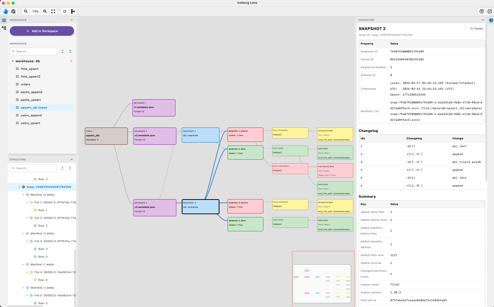
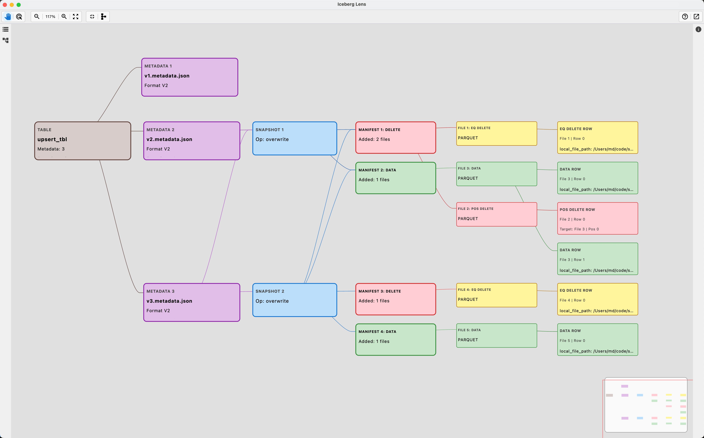

> [!TLDR]
> Point it at a table directory and it renders the structure engines walk on every query — metadata files, snapshots, manifest lists, manifests, data and delete files, and the rows inside them — as a graph you can click through, next to an inspector showing every field the format records. Nothing is written back.
>
> - Iceberg v1–v3 and Paimon, detected per directory; local folders or `s3://`, `gs://`, `r2://`
> - A desktop app, an IntelliJ tool window, and `icelens` on the command line, over one engine
> - No catalog, no service: a table is opened by its location

## What it looks like {#look}



*The overview: workspace and structure on the left, the graph, and the inspector on the selected snapshot.*

## What it answers, level by level {#levels}


## What the numbers mean {#numbers}

Table-format figures are easy to state and easy to get wrong, because both formats share structure on purpose: one manifest is referenced by every snapshot that carries its files forward. Iceberg Lens reports two sets side by side, each labelled.

```oku-compare-grid
{"cards":[{"t":"Current snapshot","b":"What the table holds now — the manifest closure of current-snapshot-id, live entries only. Its record count is what a query returns."},{"t":"All retained history","b":"What is still on disk — every manifest and data file reachable from any retained snapshot, deduplicated. This is what expiry and orphan cleanup reason about."}]}
```

Caps are always named: when the graph draws a subset of a manifest's entries, the card says so and the inspector lists all of them.

## The graph {#graph}



Every node is a card; a click opens it in the inspector, and the structure panel keeps the same tree as text. Four layouts, a snapshot filter to isolate one commit's subgraph, find by path, partition or operation, arrow keys across the drawing, export as SVG, PNG or JSON.

## Where to go next {#next}

```oku-compare-grid
{"cards":[{"t":"Quick start","b":"Installers, running from source, the workspace, the command line.","href":"quick-start.html"},{"t":"Everything it does","b":"The full list, grouped by the level each answer lives on.","href":"features.html"},{"t":"Formats and limitations","b":"What is read of Iceberg and Paimon, and what is not done.","href":"formats.html"},{"t":"Architecture","b":"One engine, three shells; the data flow from files to graph.","href":"ARCHITECTURE.html"}]}
```
