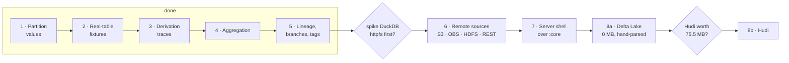

> [!TLDR]
> The graph now bounds itself on a production table and says on screen exactly what it is not
> drawing. Three format gaps closed behind it, and the defect that verifying it turned up is
> closed too.
>
> - **Shipped:** page size as a setting, one sibling order shared by layout and aggregation, the deletion-vector edge, recorded-first data-file paths.
> - **Then fixed:** the canvas mixed pixels and dp, so every card overlapped on a display scaled above 100%. One conversion now, applied everywhere the two spaces meet, with a render-level assertion behind it.
> - **Blocked on you:** the `httpfs` spike, Hudi's 75.5 MB, and the rename.

This is a status report, not a guide — read the sections in any order. The roadmap file at the
repository root is the authoritative backlog; this page is the shape of it.

## Where it stands {#state}

```oku-kpi-grid
{"tiles":[{"num":"456","label":"tests, 0 failures"},{"num":"0","label":"commits pushed, of 51"},{"num":"9","label":"real-table fixtures"}]}
```

Both Iceberg and Paimon are read from a local directory with no engine, no catalog and no
network. The working tree is clean, the build is green, and the desktop shell launches and loads
a table. Nothing has been pushed — that remains your step.

## What shipped this round {#shipped}

The aggregation work from the previous round left five things open. All five are closed, and the
first four turned out to be one control rather than four features: a badge on the canvas that
states what is drawn, why the rest is not, and what to do about it.

The page size is the knob behind it. Its effect is not linear and not subtle — below the size of
a table's largest sibling run the graph collapses hard, and past it the knob is inert:

```oku-chart
{"type":"grouped-bar","title":"Nodes drawn at each page size, measured on two checked-in fixtures","categories":["1","2","3","8","24","96"],"series":[{"label":"mor — 38 nodes in the graph","color":"accent","values":[2,7,12,38,38,38]},{"label":"branched — 26 nodes","color":"warn","values":[2,6,10,21,26,26]}]}
```

That flat right-hand half is the reason the shipped default of 24 draws every checked-in fixture
whole: these tables are small, and only a production table ever sees a group. It is also why the
default cannot be validated by the fixtures alone — the tests that prove the mechanism run at
page sizes nobody ships, and one test drives the real `AppState` at 24 against a table built with
40 and 60 metadata versions precisely so the shipped number is exercised somewhere.

The 24 itself comes from the measured budget: composed node cards cost 6.4 ms at 100 nodes,
14.6 ms at 1,000 and 42.3 ms at 2,000, against a design target of 500 cards on screen.

```oku-table
{"headers":["What was open","What it is now"],"rows":[["Page size fixed at 24, changeable only by recompiling","A persisted setting, offered from the badge. Changing it clears the expansion — a group id names a page *at a size* — and drops every cached graph but the one on screen"],["Expanding one page at a time; 5,000 manifests is 208 double-clicks","**Show all N manifests** beside **Show the next page**, with the count on the button because that is what decides whether you want it"],["Nothing on the canvas said the graph was partial","A badge, bottom-left, opposite the mini-map: *Drawing 431 of 6,180 nodes*, then why the rest are missing, counted separately for aggregation and for the snapshot filter"],["Sibling order was the order the builder emitted edges","One definition (`SiblingOrder`) read by layout for placement and by aggregation for membership. They disagreed for any manifest carried forward, so the first page under a later snapshot could be five manifests from the middle of its run"],["Sample rows were exempt from the page size","The pass runs again over them. Inert at 24 against five rows per file — and the page size is now a setting whose smallest choice is 8"]]}
```

Three format gaps closed alongside it. A v3 deletion vector's `referenced_data_file` is drawn as
an edge, which is the only delete-to-data link Iceberg records at file granularity. A data file
recorded outside its table directory is now read where the table says it is, the same
recorded-first rule the manifests have used since the `write.metadata.path` fix — before this, a
`write.data.path` table reported every file missing while they sat on disk exactly where the
manifest said. And `lastSequenceNumber` was `Int` where the spec says `long`, which is not a
misread but a refusal: one out-of-range field and the whole `metadata.json` fails to parse.

Two things landed after that. The manifest inspector now shows each of `manifest_file`'s six
counts beside the same figure folded from the manifest's own entries — a scan trusts those counts
without opening the manifest and nothing on the read path checks them, so the inspector does. Its
test is the suite's only assertion that compares what this code decoded against what Iceberg
recorded about the same bytes: 192 figures over 8 tables, all agreeing. And the one flaky test in
the build now takes the fastest of seven warmed trials instead of the sum of three cold ones, so
a red build there means something again.

## The defect that came out of it {#density}

Rendering the canvas into an off-screen scene — added so the badge's *placement* could be checked
rather than the badge alone — showed the graph drawing correctly at one display density and
overlapping at another. The layout model was innocent: a pairwise rectangle check over its own
coordinates finds no overlapping pair at any page size. The drawing is where the units diverged.

```oku-chart
{"type":"bar","title":"Two metadata cards: the space the layout left, and the space each card takes","rows":[{"label":"Pitch the layout assigned","value":104,"display":"104 px"},{"label":"Card height at density 1","value":96,"display":"96 px"},{"label":"Card height at density 2","value":192,"display":"192 px"}]}
```

`Modifier.offset { IntOffset(...) }` is specified in **pixels**; `Modifier.size(n.dp)` is in
**dp**. Feed a layout engine's coordinates straight into the first and the graph is a pixel
space, while every card in it keeps scaling with the display. At density 1 the two agree, which
is why this was never visible here; at 150% Windows scaling every column overlapped its
neighbour.

The fix was the decision, not the edit: **the graph model is dp, the surface is pixels, and
`zoom * density` is the one conversion between them.** The alternative — keeping positions in
pixels — would have meant deriving card sizes from the density instead, and a graph that renders
at a fixed pixel size is legible on one monitor and tiny on another. Every place that crossed the
boundary now names which side it is on: node placement, edge drawing, drag deltas, the marquee,
culling, the pan clamp, zoom-to-fit, scroll-into-view, the tooltip, the opening pan, the scroll
step, and both halves of the mini-map.

```oku-info-tip
{"summary":"Two more defects came out of the same pass, both in the same file","content":["**Scroll-into-view scaled the wrong thing.** Centring a node solves `centre * scale + offset = viewport / 2`. The code scaled the *difference* between the node and the viewport centre, which agrees with that only at a zoom of exactly 1 — so selecting an off-screen node at any other zoom put it somewhere other than the middle. Present since the canvas was written, and independent of density.","**The mini-map's viewport rectangle was drawn outside the mini-map.** That rectangle is the viewport expressed in graph units, so it is larger than the map itself whenever the whole table fits on screen — and Compose clips nothing by default, so it ran off the map and across the graph. Visible in the canvas render as a blue rectangle leaving two edges of the scene. Clipping after the border keeps the frame and confines what is drawn in it."]}
```

The verification is the part that was missing before. A scene of twice the pixels at twice the
density is the same window on a display scaled to 200%, so every mark has to land at exactly
twice the coordinate; the test measures the ink the canvas actually left and compares the two
rectangles. Run against the reverted fix it reports `(994, 847)-(2461, 959)` where twice the
density-1 drawing is `(998, 826)-(2602, 972)`.

## What remains {#remains}

The roadmap runs as a chain with two gates in it. Everything before the first gate is done:



One item sits outside that chain and it is not gated. The **manifest pruning evaluator** — type
a predicate, see which manifests a scan would skip and why — is the one capability no examined
tool has, and every input it needs now exists: partition summaries, decoded bounds, and each
manifest's own spec. Iceberg itself counts pruned entries and discards them, so *which* files a
scan skipped is unavailable from any surface. It needs a decision before it needs code: the
predicate is a small language, and what it accepts is a design question rather than an
implementation one.

Below that, in rough order of value per hour:

```oku-step-flow
{"ordered":false,"steps":[{"t":"Branches on separate tracks","b":"Lineage edges, refs and lineage-ordered layout all exist, so a fork is followable — but every snapshot shares one column, and with more than two branches the edges cross. A commit-graph UI puts each branch on its own lane, which here means giving the snapshot column a second dimension the layered layout does not currently have."},{"t":"Derivation traces, the rest of them","b":"The table summary folds from a per-manifest ledger, and each of the manifest list's six counts is now shown against the entries it summarises. Column statistics and per-entry drill-down are still numbers a reader has to trust."},{"t":"Extract the toolbar","b":"App.kt is ~1k lines and the toolbar is the largest inline block left. AppState and AboutDialog are already out."},{"t":"Puffin statistics files","b":"Statistics and partition-statistics are held as raw JSON and the blobs they point at — NDV sketches and the deletion vectors themselves — are never opened."},{"t":"v3 beyond deletion vectors","b":"Row lineage (first-row-id, added-rows, _row_id) and the variant / geometry / geography / timestamp_ns types are parsed only in the sense that unknown fields are dropped."}]}
```

## The three decisions {#decisions}

None of these is blocked on work. Each is blocked on a call.

**Remote sources — spike `httpfs` first, or write the SDK path?** DuckDB 1.4.4.0 is already
bundled and `LOAD httpfs` was verified available offline; `LOAD azure` was not.

```oku-compare-grid
{"cards":[{"t":"Spike DuckDB httpfs first","b":"glob + read_blob covers listing and byte retrieval for 0 MB of new dependency, against 8.36 MB and 32 jars for AWS SDK v2. The catch is that read_blob materialises the whole object, so a 200 MB Parquet footer read becomes a full download — which may not matter for metadata, since manifests and manifest lists are small and are what this tool reads. One measurement against a real bucket decides both the dependency and the code path.","verdict":"in","accent":"success"},{"t":"Write the AWS SDK path now","b":"Range reads are native, the failure modes are known, and the 8.36 MB is measured rather than guessed — it was run-verified against live MinIO with a bytes=-8 range read. It is the safe answer, and it forecloses the cheaper one without having measured it."}]}
```

**Hudi at 75.5 MB.** `hudi-common` 1.2.0 has zero Hadoop references and ships a pure-Java HFile
reader, but 54 MB of its closure is rocksdbjni and its on-disk layer needs three bespoke readers.
The lean recorded earlier still holds: last, after Delta ships, and as an optional download
rather than in the base installer — with "is rocksdbjni excludable?" as the question that would
change it.

**The rename.** `ICEBERG` is a registered ASF trademark and the policy prohibits Apache marks in
third-party product branding; `IcebergLens` and `com.iceberglens.desktop` are exactly that form.
The sanctioned construction is *&lt;Name&gt;, Powered by Apache Iceberg*, and there is a permission
route at `trademarks@apache.org` that has not been used. You asked to defer the name, not the
decision — it stays a tracked item with no work against it.

## What is not verified {#limits}

Worth stating plainly, because each is a place where confidence would be wrong.

```oku-table
{"headers":["Claim","How it was established","What that does not cover"],"rows":[["The canvas now draws the same graph at any display scale","Run — the same graph rendered into scenes at density 1 and 2, the ink measured, and the two rectangles compared; run again against the reverted fix, where it fails","Not observed in the running app on a scaled display. This machine reports density 1, and there is no Windows machine here to see the real thing. The assertion covers placement and size, not whether the result reads well at 200%"],["Every card fits the height its node declares","Looked at, in `graph-cards-*.png`","Not asserted. A pixel probe was written and it does not work: the `Column` is measured against the fixed height and each `Text` clips itself, so nothing is ever painted outside the box for a probe to find"],["The expand path works at the shipped page size","Run — `AppStateAggregationTest` drives the real `AppState` at 24 against tables with 40 and 60 metadata versions","The double-click that triggers it in `App.kt` is one uncovered line. No table on disk is large enough to group at 24, and screen capture is unavailable on this machine"],["Both formats read correctly","Run — 9 checked-in tables, expected values taken from Iceberg's own metadata tables","The runtime-written Avro fixtures are not an oracle: writer and reader schema are the same derived object, so a field typed against the wrong spec width passes all of them"]]}
```

One correction worth carrying out of this round: the knowledge-base note on card clipping said
the surplus lines are painted outside the card and covered by the border. They are not — they are
measured away and clipped by each `Text`. The mechanism decides whether the defect is testable,
and it is not, by that route. The note is fixed.
